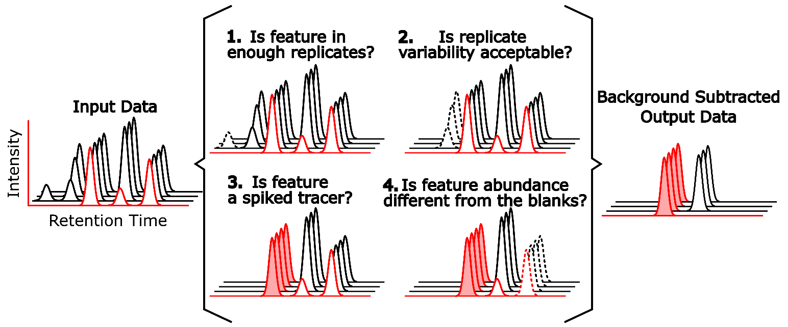
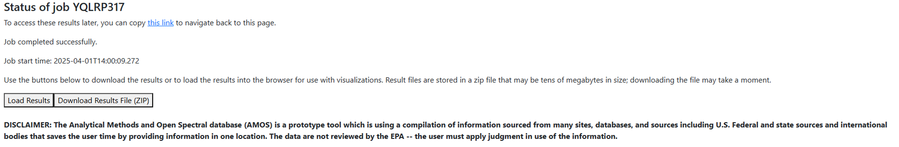
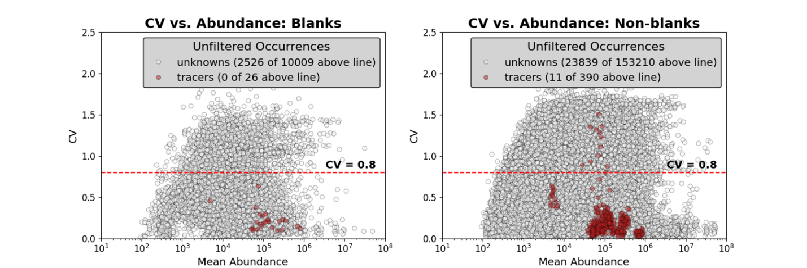
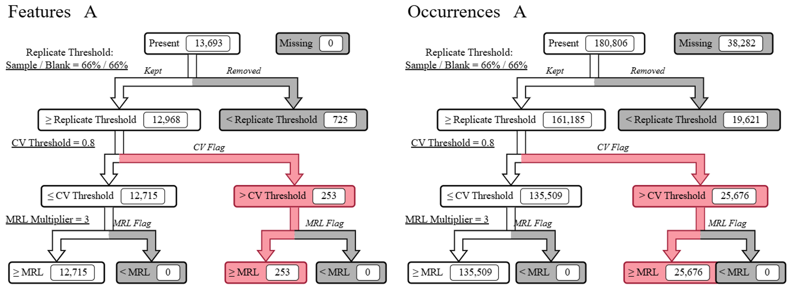
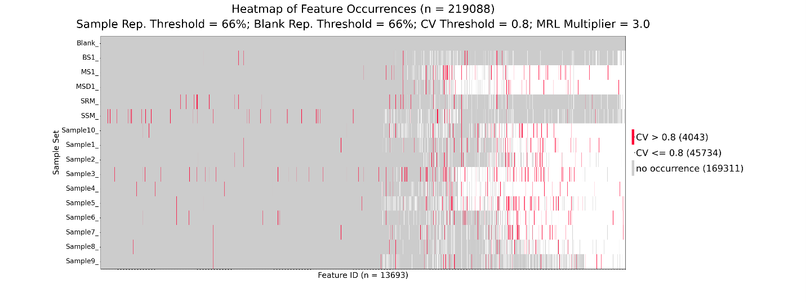
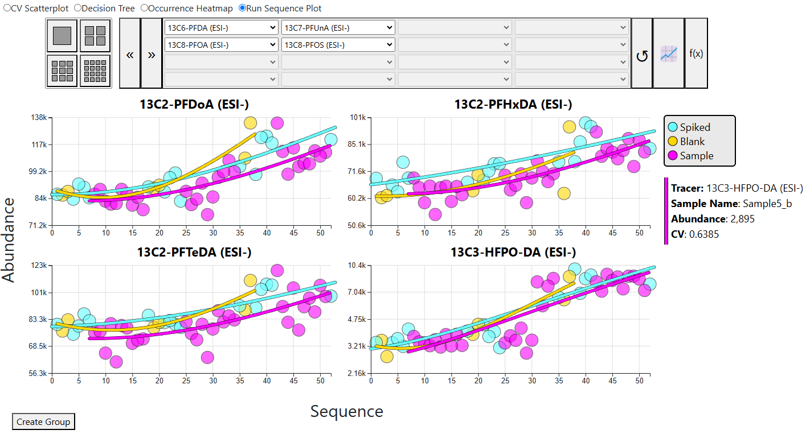

```{r, echo=FALSE, out.width="100%"}

```

## Introduction

Non-targeted analysis (NTA) methods utilize high-resolution mass spectrometry (HRMS) to measure chemicals without requiring pre-existing knowledge of their presence. These methods are not reliant on analytical standards or reference data (e.g., standardized methods, reference spectra) to perform measurements and instead use generalized approaches to measure thousands of chemicals across a vast chemical space. The use of NTA by the U.S. Environmental Protection Agency’s Office of Research and Development (ORD) is summarized in the video below. Within ORD, NTA methods are employed to identify contaminants in drinking water,^1,2^ environmental media,^3-8^ consumer products,^9,10^and biological samples^11-13^ among other applications.

{width="100%"}

The primary goal of an NTA experiment is to acquire data to identify chemicals without prior knowledge of a given sample’s chemical composition. These chemicals may be small-molecule contaminants, biological metabolites, environmental or biological transformation or degradation products, and more. Results generated by NTA experiment may be used to (1) expand the chemical space of traditional targeted analyses, (2) prioritize chemical selection for additional screening (e.g., toxicological), or (3) inform exposure, risk, or hazard assessments. For regulatory agencies that utilize chemical data to inform decision-making there is an obvious need for transparent, reproducible, and defensible chemical occurrence and exposure data. Many working groups (NORMAN, mQACC, MERIT, PARC, and BP4NTA) have defined necessary data quality and reporting guidance for NTA studies, though, there are few standardized tools or resources that utilize developed guidance to support analysis or processing of acquired NTA data.^14-17^

**INTERPRET NTA** (**Inter**face for the **P**rocessing, **Re**view, and **T**ranslation of **NTA** data) is a module of the Analytical Methods and Open Spectral (AMOS) Database developed by ORD that focuses the standardization of NTA data analysis and reporting. This tool seeks to: (1) automate and standardize NTA data quality processing and reporting, (2) permit identification of chemicals in NTA data using predicted and experimental chemical spectra, and (3) increase interpretability of NTA data by using reference and predicted data curated in EPA’s [DSSTox (Distributed Structure-Searchable Toxicity) database](https://www.epa.gov/comptox-tools/distributed-structure-searchable-toxicity-dsstox-database) and [cheminformatics tools](https://www.epa.gov/comptox-tools/cheminformatics-analysis-modules-resource-hub).

INTERPRET NTA includes one primary workflow (MS1 data processing) that can be used with optional workflows for MS2 spectra searches (e.g., experimental spectra curated by AMOS and in silico predicted spectra using CFM-ID) and for quantitative non-targeted analysis (qNTA). Recent work has described the use of INTERPRET-NTA to support QA/QC review of MS1-level data in an NTA study investigating contaminants in a de facto water reuse study and in the identification of PFAS in surface and groundwaters.^18,19^ The use of INTERPRET NTA to support investigations of PFAS in drinking water resources is described in the [ENTAiLS toolkit](https://whitehead-heather.github.io/ENTAiLSToolkit/), where an abbreviated protocol for its use is given.

This user guide describes the data requirements, input files and parameters, logic, and outputs of INTERPRET NTA. Throughout the user guide an example data set is provided for additional context.

> *Disclaimer: Sections of this document have been adapted and reproduced with permission from the ENTAiLS Toolkit that describes the development and application of NTA workflows for the investigation of per- and polyfluoroalkyl substances in drinking water resources.*

## Definitions

*Adduct*: Ions formed during ionization from the interaction of analytes with other components of the sample or buffer

*Chemical feature*: A measurement of a mass-to-charge (m/z) at a specific retention time in a HRMS method

*Chemical space*: the constituents of a sample across a multidimensional swath of chemical properties. All possible chemicals within a range of physicochemical properties imposed by the sampling, preparation, and analysis processes

*Data dependent acquisition (DDA)*: A HRMS data acquisition method that uses successive precursor and product scans to collect both MS1 (precursor ion) and MS2 (fragment ion) information based on some heuristic value (e.g., most abundant ions previously unsampled)

*Data independent acquisition (DIA)*: A HRMS data acquisition method that does not select specific precursors, and instead generates fragmentation spectra from unbiased mass ranges

*Duplicate feature*: A chemical feature that is within a set mass (in units of ppm or Da) and retention time (in units of minutes) tolerance of another feature that can be treated as a duplicate of the other feature

*High-resolution mass spectrometry (HRMS)*: Analytical chemistry technique that allows the measurement of a mass-to-charge (m/z) ratio by utilizing high resolution mass analyzers

*Internal standard*: A chemical that is added to samples to track performance of the sample preparation and/or data acquisition methods used

*Isotopically-labeled compound*: A compound where one or more atoms are a stable heavy isotope, such as 13C or 2H, typically spiked into samples as an internal standard

*Liquid chromatography (LC)*: a technique that uses a solid stationary column phase and analytes dissolved in a flowing mobile phase to separate chemicals based on the differences in their interaction between the phases

*Minimum reporting limit (MRL)*: the smallest measured amount of a substance that can be reliably measured using a given analytical method

*Native compound*: An analytical standard of a known chemical (the non-labeled version of an isotopically-labeled compound)

*Neutral losses*: Phenomena in mass spectrometry where during ionization and/or fragmentation a neutral molecule (e.g., H2O, CO2) is lost from the parent molecule, leading to two unique features separated by the mass of the neutral molecule lost

*Non-targeted analysis (NTA)*: A technique utilizing HRMS instrumentation that characterizes the chemical composition of a sample without the use of a priori knowledge of the chemical composition

*Run Sequence*: The order in which study and QA/QC samples were acquired on the instrument during data acquisition

*Suspect screening analysis*: A technique utilizing HRMS instrumentation that relies on the use of predefined lists or libraries that contain reference data (retention time, mass, fragment ions, and more) for chemicals of interest to narrow the scope of data acquisition and/or data processing

*Tracer*: Known chemical compounds spiked into study samples that can be used to perform data quality review and tracking

## MS1 Data Processing Workflow

The MS1 data processing workflow in INTERPRET NTA was designed, in part, to improve the performance and reporting of QA/QC procedures in NTA studies. Guiding principles include: 1) following the most current QA/QC recommendations of the international research community; 2) providing practitioners an interactive means to visually inspect their data; and 3) equipping QA/QC managers to efficiently review and document study quality. Fundamental logic of MS1 feature review is encapsulated in four steps (**Figure 1**) and described in detail in the [INTERPRET NTA Logic] section below.

```{r, echo=FALSE, out.width="100%", fig.cap="**Figure 1.** Key INTERPRET NTA QA/QC processing steps demonstrated on five MS1 features measured in one method blank (red x-axis) and three sample replicates (black x-axes). Major QA/QC filtering decisions are shown throughout steps 1-4. The red shaded feature denotes a spiked “tracer” analyte."}

```

Steps 1 and 2 (**Figure 1**) relate to the reproducible detection of features across replicates. Specifically, step 1 considers the number of detections across replicates and step 2 considers the measurement variability across replicate detections. Features that are not reproducible in samples (dashed peak) can be removed to ensure only high-quality features are maintained for analyses.

Step 3 uses an input file of named chemicals alongside their expected monoisotopic masses and retention times to identify and flag specific features as “tracers”. A “tracer” is any known chemical spiked into study samples at a detectable concentration. Tracers are chosen to be relevant to the detectable chemical space being investigated and are generally isotopically-labeled internal standards. As described previously, tracer measurements are useful to track method performance. Specifically, tracer measurements within and across sample groups allows users to directly investigate method performance using visual and tabular outputs.

Step 4 of INTERPRET NTA filtering logic relates to the identification of feature occurrences in study sample at levels exceeding those observed in designated blanks. An NTA study can include a variety of blanks that allow assignment of “background” features to sample collection, preparation, or data acquisition steps. Background signals of features measured in these blanks should be accounted for in study samples to ensure accurate evaluation of the abundance trends (e.g., difference in abundance levels across analytes). Feature occurrence should only be considered “real” if the measured abundance exceeds blank values by a defined threshold. A minimum reporting limit (MRL) estimate can be made using replicate measures of the blanks. Specifically, mean and standard deviation estimates across blank replicates can be used to define the MRL, with the user selecting a standard deviation multiplier of 3, 5, or 10 (the 3× multiplier yields the lowest MRL and the 10× multiplier yields the highest MRL for any features measured in blank replicates). Sample occurrences with abundances lower than the MRL can be treated as non-detects, with features removed from further consideration if all sample occurrences are deemed “non-detects”. For sample occurrences where the measured intensity is greater than the estimated MRL, the intensity is blank-subtracted using the blank mean such that the abundances in the final output table account for contribution from samples alone and not blanks.

Additional QA checks include flagging potential duplicate features (those with both a mass and retention time within the same defined windows), adduct features (those that differ by discrete masses that relate to known adduct forms), and neutral loss features (those that differ by discrete masses that relate to known neutral losses). These flags are included in the output table for user review.

The final outputs of the MS1 data processing workflow in INTERPRET NTA include QA/QC filtered feature lists (both with and without flagged features and occurrences) and a combination of interactive and static plots featuring the performance of tracer chemicals and individual occurrences. Each output from INTERPRET NTA, and the recommended outputs to include for NTA study reporting, are described in the following sections.

### Data Requirements

The primary input for the MS1 data processing workflow is a MS1-level feature list. This data frame is a N by M matrix, where N represents the total number of features identified (as rows) and M represents the total number of samples (as columns). Each row should be for a unique feature (e.g., a unique mass and retention time pair). In addition to the sample-level data (e.g., observed peak areas), columns should also contain feature-level data (mass or m/z, retention time, unique identifiers).

For a typical NTA experiment using LC-HRMS there may be thousands of chemical features detected across study samples. Importantly, INTERPRET NTA MS1 data processing can handle the processing of tens-of-thousands of chemical features across hundreds of samples, ensuring fast and standardized QA/QC reporting for large and small NTA data sets. INTERPRET NTA also supports the analysis of LC-HRMS data from both ESI negative and ESI positive acquisitions. Some studies may use both modes, where others may only use one, depending on the chemical space being investigated. Users may submit data from one or both modes when executing jobs. If submitted together, the tool will generate one set of outputs in which data from both positive and negative mode inputs are combined.

The investigation of LC-HRMS data quality using INTERPRET NTA is reliant on the use of tracer chemicals (e.g., known chemicals spiked into samples) to produce both visual and tabular outputs. The use of internal and/or native standards in LC-HRMS studies to track method and instrument performance and to assist in the identification of chemical candidates is commonplace and should be done for all studies wishing to utilize INTERPRET NTA’s full QA/QC and data review features. In addition to the inclusion of tracer chemicals, users should also prepare run sequence files that record the order of and type of samples during data acquisition to aide in the investigation of run sequence, matrix, and batch effects in their LC-HRMS data.

#### Data Types and Quality

Data input to INTERPRET NTA is expected to be from LC-HRMS experiments, where chemical features are measured as an accurate mass (e.g., 413.9737 g/mol) at a specific retention time (e.g., 6.2 minutes). Data acquired from low-resolution or other mass spectrometry platforms is not suitable for INTERPET NTA processing.

The MS1 Data Processing workflow requires only MS1-level data (e.g., feature lists). This means HRMS data that can be input into INTERPRET NTA may be from MS1-only (e.g., no fragmentation) data acquisition or may have acquired MS2 data. Studies with MS2 data can have data acquired through either data-dependant (DDA) and data-independent (DIA) acquisition methods.

INTERPRET NTA uses both mass tolerance and retention time tolerance windows to aide in identification of tracers, adducts, neutral losses, and duplicate features. To ensure these tolerances are utilized properly, input data must have the appropriate precision relative to the measurement technique used, here LC-HRMS. Mass tolerances can be set in units of Da or ppm and should be set with an understanding of the typical performance of the instrument and methods utilized. For most HRMS systems this will typically be no more than 0.002 Da or 10 ppm but may be smaller for select HRMS platforms or instruments.

Retention time tolerances are set with units of minutes and should be chosen based on an understanding of the typical performance of the instrument and methods utilized. Most reverse-phase liquid chromatography methods will produce peak widths in the range of 5-20 seconds with the variability in observed retention time less than 10-15 seconds between injections.Isomeric chemicals may produce many peaks across a longer time (30 seconds or more). Users should consider the potential presence of isomeric chemicals in their data and how they wish to treat (e.g., consider together or separately) these features in their data processing.

#### Spiked Compounds (Tracers)

INTERPRET NTA utilizes known compounds spiked into samples, termed tracers, to assist in data quality review. Tracer chemicals can take a variety of forms, primarily either as native compounds spiked into select control samples (e.g., surrogate chemicals, system suitability mixtures, etc…) or as internal standards spiked into all sample extracts. The use of these different types of spiked compounds as tracer chemicals is described in more detail below.

**Native Compounds**: are chemicals that are spiked into select control samples (e.g., matrix spikes, method spikes, laboratory controls, etc…) and represent at least some of the chemicals of interest for the NTA study. These chemicals could be found in study samples and are often included in order to determine chromatographic, MS1, MS2, and method performance parameters for chemicals of interest.

**Internal Standards**: are chemical standards that are spiked into samples (before and/or after extraction) that can be used to identify analyte loss or gain during sample preparation, define matrix effects, and ultimately enable accurate quantification of native compounds. Internal standards should not be present naturally in samples and should produce a stable, validated response when using the method. Internal standards should properly represent the chemical space of your analytes of interest and have applicability to the native compounds included in the study. Isotopically-labeled analogs of representative compounds fulfill the role of internal standards well and offer the best representation of matrix effects on study analytes, while not being found in study samples. Unfortunately, not all chemicals have isotopically-labeled internal standards available for purchase.

#### Types of Blanks

Blanks are critical to an NTA study to ensure chemicals identified in samples are attributable to to study samples and are not contaminants introduced during the collection, preparation, or analysis of samples. Many studies will utilize a variety of blank types (e.g., solvent, trip, field, equipment, lab, method, or matrix) to assess and measure different sources or routes of contamination. **Table 1** below, adapted from Whitehead et al. (2025) defines different types of blanks that are commonly employed in an NTA study.

```{r, echo=FALSE}
library(knitr)
library(kableExtra)
blanks=read.csv("C:\\Users\\HWHITEHE\\OneDrive - Environmental Protection Agency (EPA)\\Profile\\Desktop\\General Work\\Manuscripts\\User guide\\Markdown\\figures or tables\\blanks.csv",check.names=FALSE)

blanks %>%
kable(caption ="**Table 1.** Different blanks that can be utilized in a typical NTA study.",format="html", align="c",html_font="Lato") %>%
kable_styling(full_width=F, html_font= "Lato", bootstrap_options=c("striped", "hover","responsive"))
```

Blanks are also critical to the functionality of QA/QC filtering performed by INTERPRET NTA where blanks are used to perform (1) MRL calculations and (2) blank subtraction.

A minimum reporting limit (MRL) [can be defined as](https://water.usgs.gov/owq/OFR_99-193/minimum.html#:~:text=The%20MRL%20is%20defined%20by,19) the smallest amount of a substance that can be reliably measured using a given analytical method. Calculation of an MRL is an important step for studies reporting both the identification and/or the quantification of chemicals in a sample. The MRL calculation performed in INTERPRET NTA is described in more detail in the [INTERPRET NTA Logic] section below, but briefly is determined for a given feature using the measured abundances in blank replicates to calculate the mean blank abundance ($\widehat{μ}$). The user then selects an MRL standard deviation ($\widehat{σ}$) multiplier (M) of 3, 5, or 10. The MRL for each feature is then calculated as the mean blank abundance plus multiplier times standard deviation, as shown below.

<center>MRL=$\widehat{μ}$+(M×$\widehat{σ}$)</center>

<br> Assuming that blank detection abundances for any feature are normally distributed, M values of 3, 5, and 10 allow approximation of the upper (one-tailed) 97.5th, 99.5th, and 99.9th percentiles of the blank abundance distribution. A MRL is calculated for all features where a reproducible abundance is measured in blank replicates. Features where no signal is observed in the blanks have an MRL set to 0. The measured abundance of features in samples is compared to the calculated MRL to ensure that abundances found in samples are larger than those in blank replicates.

In addition to MRL checks, INTERPRET NTA uses blank subtraction to remove feature abundances observed in blank replicates from study samples. While blank subtraction is commonly used in traditional quantitative analyses (e.g., targeted LC-MS/MS), its use and application in NTA experiments is typically dependent on the individual study and researcher. In INTERPRET NTA blank subtraction serves to remove the contribution of background signal of features from samples occurrences that have passed MRL checks. Blank subtraction is described in more detail in the [INTERPRET NTA Logic] section below, but briefly is determined by subtracting the mean blank abundance ($\widehat{μ}$~blank~) from the mean sample abundance ($\widehat{μ}$~sample~) for a given sample replicate.

<center>Blank subtracted sample abundance= $\widehat{μ}$~sample~ - $\widehat{μ}$~blank~</center>

<br> The blank(s) used are decided by the user and should represent the most complete and relevant background possible. For example, a *laboratory blank* made with just the final extract diluent will contain background features introduced from the solvent(s) used to prepare the diluent. In comparison, a *method blank* containing a matched “blank” matrix that undergoes the same preparation steps as the samples is expected to contain any background features introduced during sample preparation, including those from the solvent(s) used to prepare the diluent. In this example using a *method blank* would more appropriately capture all potential background features than the *laboratory blank*.

When isotopically-labeled compounds are utilized in a study, the blank(s) used for processing should also contain these compounds at a spiking concentration identical to that in study samples to allow direct assessment of method performance with INTERPRET NTA’s tracer functionality. For more information on the tracer functionality, please see the [Tracers] section below.

Studies with more than one blank type should decide which blank(s) should be used to perform MRL checks and blank subtraction. The blank(s) chosen should be identified using specific character strings in their sample names, as described in the [Detection Matrices] section below. Additional blanks that are not chosen may be kept in the input data and treated as samples for INTERPRET NTA processing. Ensure any blank(s) not chosen for MRL checks and blank subtraction have names that do not include the specific character strings described in the [Detection Matrices] section below.

#### Sample and Blank Replicates

The QA/QC filtering logic described in the [INTERPRET NTA Logic] below relies on the use of both blank and sample replicates to perform replicate threshold, coefficient of variation (CV), and MRL filtering, as well as blank subtraction. Replicate data may arise from the collection of multiple samples from a single source during sample collection (*sample replicates*), the preparation of multiple extracts from a single sample during sample preparation (*preparation replicates*), or, from repeated injection and acquisition of a single extract during data acquisition (*analytical replicates* or *injection replicates*).

**INTERPRET NTA users must include, at minimum, three analytical replicates per sample and blank.** If replicate analysis occurs across multiple analytical batches, users are encouraged to include replicates across batches and to randomize replicates within each batch. The use of analytical batches and the randomization of samples is described in more detail in the [ENTAiLS Toolkit.](https://whitehead-heather.github.io/ENTAiLSToolkit/#content)

> **Summary**\
> An analytical batch can be defined as a set of study and QA/QC samples analyzed together on an instrument. Small studies may have few enough samples that all study and QA/QC samples can be analyzed within a single analytical batch. However, it is common for studies to require multiple analytical batches spread across days, weeks, or months, and the use of analytical batches can ensure that instrument/signal drift is minimized, giving sufficient “down time’ where calibration and routine maintenance can be performed. Instrument performance can be tracked between batches using QA/QC samples and elements (e.g., spiked standards, controls). Randomizing the order of which samples are injected within and across these batches can be helpful to minimize performance effects for entire groups of similar study or QA/QC samples.

Sample replicates must be identified accordingly in the input detection matrix to ensure correct grouping and processing with INTERPRET NTA. Sample and blank replicates should be identified by separation of a single character, for example, ‘My_Sample_a’ and ‘My_Sample_b’, or “Blank_a” and “Blank_b”. This may be done using letters (A-Z) or with numbers (0-9).

### Input Files

All MS1 workflow input files are tables in CSV format. Each input file has specific structure and required columns and headers, as described below. Outputs of all open source or vendor-specific data processing software can also prepared as INTERPRET NTA inputs given appropriate formatting of the CSV files. Selectable input parameters are accessed by the user through a GUI; these selectable parameters are summarized in the [Input Parameters] section below.

#### Detection Matrices

The primary input to the MS1 workflow is a detection matrix containing a list of MS1 features identified using an upstream data processing software. This software may be vendor specific (e.g., Compound Discoverer, Mass Profiler, MassHunter, Progenesis QI, or SCIEX OS) or open source (e.g., mzmine, MS-DIAL, XCMS). The detection matrix generated should be a N by M matrix, where N represents the total number of features identified (as rows) and M represents the total number of samples (as columns). Each row should be for a unique feature (e.g., a unique mass and retention time pair). In addition to the sample-level data (e.g., observed peak areas), columns should also contain feature-level data (mass or m/z, retention time, unique identifiers). These required columns are summarized in **Table 2**. An example negative mode detection matrix is attached here.

<center>

```{r echo=FALSE}
xfun::pkg_load2(c("htmltools", "mime"))
xfun::embed_file("detectionMatrix.csv")
```

</center>

<br>

**Items to note:**  

1. Feature-level information columns are typically found in the first few columns, though an exact order is not required  
2. Peak areas should not be imputed, normalized, or otherwise transformed prior to processing to ensure efficacy of the replicate, CV, and MRL filtering steps  
3. Non-detects (e.g., sample occurrences where a feature was not found by the upstream data processing software) can be input as empty cells, cells with 0 input as the peak area, or cells with another constant value input  
4. The user must identify how non-detects are input in the input parameters, as described in the [Input Parameters] section below  

Additional columns (e.g., initial annotations from upstream data processing, other metadata) beyond those described above may also be included in the input detection matrix and will be treated as pass-through columns that are unaltered during processing.

```{r, echo=FALSE}
library(knitr)
library(kableExtra)
blanks=read.csv("C:\\Users\\HWHITEHE\\OneDrive - Environmental Protection Agency (EPA)\\Profile\\Desktop\\General Work\\Manuscripts\\User guide\\Markdown\\figures or tables\\DM.csv",check.names=FALSE)

blanks %>%
kable(caption ="**Table 2.**Required columns and their description in the input Positive and Negative mode files (detection matrices).",format="html", align="c",html_font="Lato") %>%
kable_styling(full_width=F, html_font= "Lato", bootstrap_options=c("striped", "hover","responsive"))
```

#### Run Sequence

The run sequence file(s) contain a list of all samples included in the input detection matrices alongside sample groupings that identify the samples within user-defined groups. The requirements of this list includes the name of samples (exactly matching the names used in the input detection matrices) and the sample grouping as summarized in **Table 3**. The groups included in the run sequence file will be used to group samples on the interactive and static run sequence plots generated by INTERPRET NTA.

When both positive and negative detection matrices are input a run sequence file should be prepared for both modes. An example run sequence file that is paired to the example input detection matrix is attached below.

<center>

```{r echo=FALSE}
xfun::pkg_load2(c("htmltools", "mime"))
xfun::embed_file("runSequence.csv")
```

</center>

```{r, echo=FALSE}
library(knitr)
library(kableExtra)
blanks=read.csv("C:\\Users\\HWHITEHE\\OneDrive - Environmental Protection Agency (EPA)\\Profile\\Desktop\\General Work\\Manuscripts\\User guide\\Markdown\\figures or tables\\sequence.csv",check.names=FALSE)

blanks %>%
kable(caption ="**Table 3.**Required columns and their description in the input Run Sequence files.",format="html", align="c",html_font="Lato") %>%
kable_styling(full_width=F, html_font= "Lato", bootstrap_options=c("striped", "hover","responsive"))
```

#### Tracers

The tracer file contains a list of tracer compounds spiked into some or all samples and blanks at detectable concentrations. Requirements of the tracer file includes the name, anticipated ionization mode, exact mass, and the expected retention time of each tracer (**Table 4**). The anticipated ionization mode column is used to designate is a tracer chemical is expected in positive or negative mode. If a tracer chemical is expected to ionize in both modes, the input tracer file should have two lines, one with ESI+ and one with ESI- used in the anticipated ionization mode column.

<center>

```{r echo=FALSE}
xfun::pkg_load2(c("htmltools", "mime"))
xfun::embed_file("tracerFile.csv")
```

</center>

```{r, echo=FALSE}
library(knitr)
library(kableExtra)
blanks=read.csv("C:\\Users\\HWHITEHE\\OneDrive - Environmental Protection Agency (EPA)\\Profile\\Desktop\\General Work\\Manuscripts\\User guide\\Markdown\\figures or tables\\tracers.csv",check.names=FALSE)

blanks %>%
kable(caption ="**Table 4.**Required columns and their description in the input Tracer files.",format="html", align="c",html_font="Lato") %>%
kable_styling(full_width=F, html_font= "Lato", bootstrap_options=c("striped", "hover","responsive"))
```

Depending on experimental design and study objectives, separate tracer input files may be prepared for spiked native and internal standards. If separate tracer files are prepared, the user should run INTERPRET NTA twice, once with each tracer file, to separately capture visual and tabular results.

Additional columns beyond those described may also be included in the tracer file. These columns will be treated as pass-through columns with their contents unaltered during INTERPRET NTA processing. An example tracer file is attached below. This example matrix contains the isotopically-labeled internal standards present in EPA Method 1633. One additional column, “Formula”, is included as a pass-through column to track the DSSTox Substance Identifier (DTXSID) of each compound through steps of INTERPRET NTA processing.

### Input Parameters

Input MS1 parameters are set on the MS1 Data Processing Workflow page of AMOS, found at https://ccte-cced-amos.epa.gov/amos/ms1_nta/submit. All of the input parameters, a description of their utility, and their default values provided by INTERPRET NTA are summarized in **Table 5**.

```{r, echo=FALSE}
library(knitr)
library(kableExtra)
blanks=read.csv("C:\\Users\\HWHITEHE\\OneDrive - Environmental Protection Agency (EPA)\\Profile\\Desktop\\General Work\\Manuscripts\\User guide\\Markdown\\figures or tables\\input.csv",check.names=FALSE)

blanks %>%
kable(caption ="**Table 5.**Description of input parameters and files for INTERPRET NTA.",format="html", align="c",html_font="Lato") %>%
kable_styling(full_width=F, html_font= "Lato", bootstrap_options=c("striped", "hover","responsive")) %>%
  pack_rows("Input Files", 2, 6,label_row_css = "background-color: #0668b3; color: #fff;")%>%
  pack_rows("Data Filtering", 7, 8,label_row_css = "background-color: #0668b3; color: #fff;")%>%
  pack_rows("Adducts", 9, 14,label_row_css = "background-color: #0668b3; color: #fff;")%>%
  pack_rows("Tracers", 15, 19,label_row_css = "background-color: #0668b3; color: #fff;")%>%
  pack_rows("QA/QC Parameters", 20, 23,label_row_css = "background-color: #0668b3; color: #fff;")%>%
  pack_rows("Database Searching", 24, 27,label_row_css = "background-color: #0668b3; color: #fff;")
```


After all input values are completed pressing “Submit” at the bottom of the page will begin the INTERPRET NTA MS1 data processing workflow. The user is directed to a new page showing that the job is in progress. The user may return to this page at any time using the URL containing the job ID. 


### INTERPRET NTA Logic
After job submission INTEPRET NTA beings performing the MS1 data processing workflow. A summary of the key steps and logic used by INTERPRET NTA is summarized below. 

#### Data Structure Checks
Once the input files and parameters are submitted, the first thing that happens is checking for the required columns, normalizing column names, and sorting columns alphabetically. In greater detail, the application first normalizes all column names by coercing all column names to strings, stripping leading and trailing spaces, and removing non-breaking spaces.

The application then verifies that an ionization mode column is present (checks for "Ionization_Mode"; if not present, assign "Ionization_Mode" based on what selector was used to upload the file), a mass column is present (either “Mass”, or “m/z” that is then converted to “Mass” based on the ionization mode), and a retention time column is present (will rename any of “Retention_time”, “RETENTION_TIME”, “Retention time”, “Retention Time”, “rt”, “RT”, and “Ret._Time” to “Retention_Time”). If a “Mass” or “m/z” column is not present, the run will stop; if any of the accepted derivatives of “Retention_Time” are not present, the run will stop. Following the column checks, the columns are sorted alphabetically such that all sample replicates should be adjacent to one another if the correct naming convention was followed.

After formatting and column verification, the input data is assigned a new column, “Feature ID”, which provides each chemical feature (i.e., row of data) a unique numerical value. The “Feature ID” column is used throughout the application to track data, perform merges, and reassign associated metadata that may have been included in the input files (see below).

The next step is parsing the column names in the input files to group together sample replicates and identify blanks. Blanks are identified by containing any of the following strings: "Blank", "blank", "BLANK", "MB", "Mb", "mb", "mB" (NOTE: if a sample name contains any of these strings, it can be accidentally identified as a blank). Currently, the application logically separates blank and sample columns from other metadata by asserting that the groups are greater than 1 – this excludes metadata columns but is a soft requirement that samples be replicated in order to successfully be processed by INTERPRET NTA. Columns that are not identified as a blank or sample are determined to be “pass through” columns that are store in a temporary variable and appended to the data after processing.

#### Feature Removal and Flagging
If selected by the user, the void volume filter is then applied. This results in any chemical features with a “Retention_Time” value lower than the user-input value to be removed from the dataframe.

Duplicate chemical features are identified by performing matrix comparisons between chemical features’ masses and retention times. A duplicate is identified as a chemical feature whose mass and retention time are both below the user-selected threshold values with another chemical feature – a new column, “Duplicate Feature?”, will receive a value of “1” for these chemical feature pairs.

If any chemical adducts (and/or neutral losses and solvent modifiers) are selected by the user, these species are searched against the data. Each adduct has an associated mass, and similar to the duplicate flagging function, matrix math is applied to identify chemical features that are within the retention time window and mass error (specified by the user) to be (or have) an adduct – this information is recorded in three new columns: “Is Adduct or Loss?”, “Has Adduct or Loss?”, and “Adduct or Loss Info”. The first two columns, “Is Adduct or Loss?” and “Has Adduct or Loss?”, are either 0 or 1 for a given chemical feature based on whether any other chemical features are identified as possible adducts by the matrix math. For chemical features that are (or have) adducts or losses identified, more information is provided in the “Adduct or Loss Info”. The “Feature ID” of the related chemical feature is provided, as well as the adduct or loss species that the two chemical features are suspected to be related by.

The user-submitted tracer file is then merged with the data using rounded mass and retention time columns to generate a list of candidate chemical features that may be a tracer chemical. The observed masses and retention times are then compared, and the user-determined threshold values are used to determine matches between the chemical features and tracers. This information is stored in the new column, “Tracer Chemical Match?”, and appended to the chemical features data. Meanwhile, the statistics that were calculated on the chemical features are appended to the tracers file if the given tracer chemical was identified in the data. This updated tracer file is added as the “Tracer Detection Statistics” sheet to the “QAQC” excel file.


#### Feature Filtering and Cleaning
Next, statistics (mean, median, standard deviation, coefficient of variation [CV], detection count, and detection percentage) are calculated on sample groups for chemical features (e.g., “Mean Sample_1”, “Median Sample_1”, etc.). Statistics columns and adduct columns (see below) are appended to the data and are recorded in tabular outputs as the “All Detection Statistics” sheet(s) in the “QAQC” excel file. 

After statistics have been generated, the data goes through “feature cleaning”, which involves the application of replicate %, CV, and MRL thresholds (all selected by the user) to the chemical occurrences and features. A new, empty (i.e., blank cells) copy of the data is made and used to record passes and fails as the QA/QC thresholds are applied. Each threshold is enacted as a Python mask – a boolean structure that stores a True or False value in each cell according to the logic statement – and the masks are used to populate the empty data copy with strings (“R”, “CV”, and “MRL”) that designate whether a cell failed a given QA/QC filter. 

After all filters are applied, cells that passed all filters have their values re-populated. The last step is to determine if, after QA/QC filtering, there are any valid numerical observations of a chemical feature remaining. If so, the chemical feature is left alone. If not, the chemical feature is documented in a new column of the data copy, “Feature Removed?”, as having been removed (the strings from failed occurrences are aggregated here; i.e., “CV, MRL”) and the feature is filtered out of the original data. The annotated data copy is stored as the “Decision Documentation” sheet of the “QAQC” excel file.

At the end of the feature cleaning, the remaining features have their mean value observed in the blank subtracted from the mean value observed in each of the samples. This “BlankSub Mean” replaces the “Mean” columns for each of the sample groups for a given chemical feature, and better represents the actual value of the feature attributable to the study sample. If both positive mode and negative mode data were uploaded by the user, the filtered data are then combined into a single dataframe, and stored as the “Final Occurrence Matrix” sheet of the “QAQC” excel file.

#### Chemical Results Retrieval
If the user has opted to perform database retrival from DSSTox, a chemical features list is generated from the “Final Occurrence Matrix” sheet. Using an API, the masses of those chemicals are searched against the DSSTox database, returning database information for chemicals that are within a given mass tolerance (default value is +/- 5ppm). This results in a list of candidate chemicals for each feature from the input data that passed the QA/QC filtering. Optionally, hazard information can be appended to the candidate chemicals information by enabling the “Search Cheminformatics Hazard Module” toggle. This data is stored as the “Chemical Results” sheet of the “chemical_results” excel file.

### Results

INTERPRET NTA results include both visual outputs (interactive and static) and an excel output. Visuals produced include (1) CV scatterplots displaying the relationship between measured CV and feature abundance, (2) occurrence heatmaps displaying the processing fate of all occurrences with respect to CV and MRL thresholds and flagging, (3) decision trees displaying the filtering of occurrences and features across each processing step, and (4) run sequence plots displaying the response of tracer chemicals across samples. Following job completion, these visuals may be viewed by clicking the “Load Results” button as shown in **Figure 2** below. More detail on these visuals are given in the [Visualizations] section below.

```{r, echo=FALSE, out.width="100%", fig.cap="**Figure 2.** Completed INTERPRET NTA job with option to Load Results and Download Results File (ZIP)."}

```


<div class="alert alert-warning" role="alert">
Loading results make take a few moments, especially for large datasets</div>

The excel output generated by INTERPRET NTA is contained within a ZIP file that can be downloaded by clicking the “Download Results File (ZIP) as shown in **Figure 2**. This file is named as “UniqueProjectName¬\_WebApp_QAQC.xlsx” where UniqueProjectName matches the Project Name given by the user in the input parameters. The structure and contents of this file are described in more detail in the [Excel QA/QC File] sectuib below. Additional files in the .ZIP include static versions (as .png files) of the CV scatterplot, occurrence heatmap, and run sequence plots.

An example .zip folder generated by INTERPET NTA is attached below. 

<center>
```{r echo=FALSE}
xfun::pkg_load2(c("htmltools", "mime"))
xfun::embed_file("INTERPRET_NTA.zip")
```
</center>

#### Visualizations
Four visualizations are available under “Load Results” and include the CV scatter plot, decision trees, occurrence heatmap, and run sequence plots, each described in more detail below. 

**CV Scatter Plot**  
The CV scatter plot contains two subplots representing the mean abundance versus the measured CV of each sample occurrence. Information on the left subplot shows occurrences in samples that were identified as the "Blanks" in the input files, while the right subplot shows occurrences in all other samples. In each plot, the x-axis is dynamically adjusted to reflect the range of mean abundances across all samples, while the y-axis is fixed to a CV range of 0 – 2.5. In each subplot, a red-dashed line identifies the CV threshold set by the user when inputting parameters; bolded text above the line shows the exact CV value used. Red dots identify sample occurrences linked to tracers (from the tracer input file); all other occurrences are grey. The CV scatter plot may be accessed by clicking on “Load Results” and selecting the “CV Scatter Plot” option. This static visualization is also included in the .zip file downloaded from INTERPRET NTA. An example CV scatter plot is shown in **Figure 3**.

```{r, echo=FALSE, out.width="100%", fig.cap="**Figure 3.**Example CV scatter plot generated by INTERPRET NTA."}

```

The CV scatter plot can be used to assess the trends and relationship of CVs observed for tracers, compared to all other features, and to set user expectations for reasonable CV values produced by their analytical methods and data processing tools. Typically, tracers are spiked at concentrations that are known to be well-above any measured or estimated instrumental and method detection limits. Accordingly, tracers are expected to have mean abundances that reflect this spiking level (relative to any measured or estimated dynamic range for an instrument and method). Since the tracers are spiked, CVs should be low if the instrument and method are operationally stable. Under suitable spiking concentrations, many NTA methods can produce CV levels close to that of targeted methods, and often below 0.5. For context, many targeted analysis methods allow CV tolerances of +/- 0.3. As NTA methods are rarely validated in the same way as targeted methods, there is limited guidance for setting an allowable CV threshold for any given NTA method. 

**Decision Tree**  
The decision tree generated by INTERPRET NTA shows the pass, fail, and non-detect flags for each sample occurrence across all features. The primary function of the decision tree is to compare how different filter threshold choices change the total number of features and occurrences that are kept or removed at each processing step. The decision tree is split into two sections, called A and B. Both sections have an interface for adjusting the sample and blank replicate thresholds, the CV threshold, and the MRL standard deviation multiplier. When these values are changed the respective decision tree is updated in real time, allowing users to immediately determine the impact of individual filtering thresholds on their input data. The interfaces are separated by a table summarizes the total counts for both features and occurrences that are input to and filtered at each step of the MS1 processing workflow. The interactive decision tree may be accessed by clicking on “Load Results” and selecting the “Decision Tree” option. An example decision tree is shown in **Figure 4** below. 

```{r, echo=FALSE, out.width="100%", fig.cap="**Figure 4.**Example decision tree generated by INTERPRET NTA."}

```

Within each decision tree the upper-most level shows the number of unfiltered occurrences or features with at least one replicate detection (*Present*) and the number for which there were no replicate detections (*Missing*). The second tree level then shows the number of *Present* occurrences or features that passed the replicate threshold (*Kept*) and the number that did not (*Removed*). The third level shows the number of *Kept* occurrences or features that had CV values at or below the designed threshold. Any occurrences or features not meeting the threshold are labelled with a CV Flag. Finally, the fourth tree level shows the number of occurrences or features with mean abundance levels at or above the MRL threshold. Any occurrences not meeting the threshold are labelled with a MRL Flag. White boxes and arrows in the tree indicate occurrences that passed QA/QC criteria. All gray boxes and arrows indicate occurrences that were not reproducibly observed or not observed above the MRL. Finally, all red boxes and arrows indicate occurrences that met all QA/QC criteria except the CV threshold. Static images of these trees may be downloaded as .png using the buttons on the left of the plots for “A” and “B” to download the A or B section, respectively. 

Decision trees should be used to help optimize thresholds and values used for each filtering step in INTERPRET NTA alongside other tabular and visual outputs generated. 

**Occurrence Heatmap**  
The INTERPRET-NTA Occurrence Heatmap shows the pass/fail/non-detect flags for each sample occurrence. The occurrence heatmap is generated using data from the output excel file from INTERPRET-NTA. The interactive occurrence heatmap may be accessed by clicking on “Load Results” and selecting the “Occurrence Heatmap” option. A static version of this visualization is also included in the .zip file downloaded from INTERPRET NTA. An example occurrence heatmap is shown in **Figure 5** below. 

```{r, echo=FALSE, out.width="100%", fig.cap="**Figure 5.**Example occurrence heatmap generated by INTERPRET NTA."}

```

The occurrence heatmap is a representation of the processing outcomes for all features across study samples. The plot is oriented with features along the bottom axis and samples along the side axis. Within the plot each cell represents a sample occurrence, with the color of the cell denoting the data quality decision for that occurrence. Cells shaded gray are non-detects, defined as those for which the sample occurrence had no peak area in the input file OR those that were found to be below the calculated MRL. Cells shaded red are occurrences where the feature was reproducibly detected above the MRL, but with a CV value greater than the threshold set by the user. Cells in white are those that were reproducibly detected, above the MRL, with a CV value at or below the threshold set by the user. 

The occurrence heatmap can be used to assess the effect of the CV threshold set by the user on the entire data set and to compare the number of detected/flagged/measured occurrences across each sample type. For example:

* The sample identified as the "blank" for processing should show no detections (completely gray row).
* Other types of blank samples should also show few or no detections (mostly gray row).
* Samples that are in neat solvent (i.e., matrix-free) should likely show some detections (especially if spiked with native compounds).
* Samples that are in matrix will likely show the most detections and have some amount of "flagged" detections where the CV threshold was exceeded.

The occurrence heatmap can be used alongside other outputs to help decide if your CV threshold should be adjusted. 

**Run Sequence Plot**  
The run sequence plots generated by INTERPRET NTA are scatter plots which show the relative abundance of user-input tracer chemicals across a sample sequence. Run sequence plots are generated using data from (1) the input detection file(s), (2) run sequence file(s), and (3) tracer file. Interactive run sequence plots may be accessed by clicking on “Load Results” and selecting the “Run Sequence Plot” option. Once loaded, the run sequence plot(s) should populate as shown in **Figure 6** below. A static version of this visualization is also included in the .zip file downloaded from INTERPRET NTA.

```{r, echo=FALSE, out.width="100%", fig.cap="**Figure 6.**Default view for run sequence plot interactive visualizations produced by INTERPRET NTA."}

```

The run sequence plots allow you to investigate the performance of individual tracer chemicals to one another and across individual samples. For each plot the y-axis represents the abundance of that tracer across samples, with the range of each plot dynamically set based on the observed abundance. The x-axis for each plot represents the order sample acquisition from the run or analytical sequence. Points on each point are colored based on their user-defined group from the input run sequence file (e.g., Blank, Sample, Spiked).

The tracer run sequence plots should be used to assess the trends and relationship of tracers in the study. Of specific interest is examining batch or run sequence effects. For example:

* If the analytical sequence includes batches of samples run on separate days, the user may observe blocks of samples where tracer response is higher/lower than others.
* If the analytical sequence includes many samples, or samples with especially difficult or “dirty” matrices, the user may observe a decrease in the response across the analytical sequence.

Run sequence plots also allow general examination of total detection frequency across samples. Sub-groupings (e.g., Blank, Sample, Spiked) shown in the plots may also highlight matrix effects such ion suppression (all samples with matrix have lower response than samples in neat solution) or ion enhancement (all samples with matrix have higher response than samples in neat solution). Realistically, these plots often display a combination of run sequence and matrix effects that may require detailed consideration or examination.  

#### Excel QA/QC File
The output excel file from INTERPRET NTA contains all information used to make the plots and reports to the user which features passed QA/QC processing, as well as any annotations identified during processing (**Table 6**). The data contained on the Final Occurrence Matrix sheet is used as the final data frame of features (defined by a mass and retention time), and responses of those features in samples (as blank-subtracted means).

```{r, echo=FALSE}
library(knitr)
library(kableExtra)
blanks=read.csv("C:\\Users\\HWHITEHE\\OneDrive - Environmental Protection Agency (EPA)\\Profile\\Desktop\\General Work\\Manuscripts\\User guide\\Markdown\\figures or tables\\excel.csv",check.names=FALSE)

blanks %>%
kable(caption ="**Table 6.**Description of sheets and their contents from the INTERPRET NTA Excel output.",format="html", align="c",html_font="Lato") %>%
kable_styling(full_width=F, html_font= "Lato", bootstrap_options=c("striped", "hover","responsive"))
```


### Reporting

Findings from NTA studies can have significant public and/or ecological health implications, making it important to document the processing and quality review steps employed. The results generated by INTERPRET NTA are intended to help researchers standardize the amounts and types of QA/QC reporting for peer reviewed publications, internal and external reports, and in communications with stakeholders and clients. Examples of reporting INTERPRET NTA results can be found in Sobus et al. (2025) and Whitehead et al. (2025). 

In each of these examples a number of INTERPRET NTA outputs are included in the main text and supporting information of each manuscript, including those described **Table 7** below. Additional reporting may be necessary depending on the NTA study itself, or on how INTERPRET NTA was employed. For example, in Sobus et al. (2025) the initial input parameters used for INTERPRET NTA were adjusted following a first-pass of review to optimize tracer chemical performance. In this example, both the initial input parameters and the optimized parameters are reported and a discussion of how they were optimized is given.

**We recommend, at a minimum, that input parameters, a [Report Card] (described below) and the Visualizations produced be included alongside text summarizing and describing INTERPRET NTA processing.** 

```{r, echo=FALSE}
library(knitr)
library(kableExtra)
blanks=read.csv("C:\\Users\\HWHITEHE\\OneDrive - Environmental Protection Agency (EPA)\\Profile\\Desktop\\General Work\\Manuscripts\\User guide\\Markdown\\figures or tables\\reporting.csv",check.names=FALSE)

blanks %>%
kable(caption ="**Table 7.**Description of the INTERPRET NTA parameters and outputs that should be reported in manuscripts or reports.",format="html", align="c",html_font="Lato") %>%
kable_styling(full_width=F, html_font= "Lato", bootstrap_options=c("striped", "hover","responsive")) %>%
    pack_rows("Main Text", 1, 2,label_row_css = "background-color: #0668b3; color: #fff;")%>%
    pack_rows("Supporting Information", 3, 7,label_row_css = "background-color: #0668b3; color: #fff;")
```

#### Report Card
Whitehead et al. (2025) introduces a Report Card, used to quickly summarize the most pertinent QA/QC metrics and outputs from INTERPRET NTA processing. The Report Card summarizes outputs from both visual (CV Scatter Plots, Run Sequence Plots, and Decision Trees) and tabular outputs (Tracer Summary and Tracer Detection Statistics) generated by INTERPRET NTA. The [Visualizations] that should be included are described in more detail in the section above. Also included are summarized false positive and false negative rates determined from the Confusion Matrices described below. While not an automatically generated output from INTERPRET NTA, these confusion matrices can assist users in optimizing parameters to minimize false negatives and false positives in NTA data. See the [Confusion Matrices] section below for more information. This Report Card should be included as a table in the Supporting Information of a manuscript or in appendices of reports and can be summarized in the main text. 
```{r, echo=FALSE}
library(knitr)
library(kableExtra)
blanks=read.csv("C:\\Users\\HWHITEHE\\OneDrive - Environmental Protection Agency (EPA)\\Profile\\Desktop\\General Work\\Manuscripts\\User guide\\Markdown\\figures or tables\\reportCard.csv",check.names=FALSE)

blanks %>%
kable(caption ="**Table 8.**Example Report Card that can be used for INTERPRET NTA reporting.",format="html", align="c",html_font="Lato") %>%
kable_styling(full_width=F, html_font= "Lato", bootstrap_options=c("striped", "hover","responsive"))%>%
  footnote(general= "^1^Values from Tracer Detection Statistics and Tracer Summary sheets
^2^ Values calculated from CV Scatter Plots of Tracer Chemicals  
^3^ Qualitative interpretation from Run Sequence Plots  
^4^ From Decision Trees at Feature and Occurrence level  
^5^ Values from Confusion Matrices.")
```


#### Confusion Matrices
The use of confusion matrices to calculate false positive (FPR) and false negative rates (FNR) to support quality review of tracer chemical data from INTERPRET NTA was first introduced in Sobus et al. (2025) and subsequently used in Whitehead et al. (2025). While not a generated output of INTERPRET NTA results, the investigation of FPR and FNR can aide in identifying individual tracer chemicals with quality issues and in identifying trends across many tracer chemicals. An example matrix showing the categorization of true positives (TP), false positives (FP), true negatives (TN), and false negatives (FN) is shown in **Table 9**. The calculation of FPR, FNR, true positive rate (TPR), and true negative rate (TNR) using these values is shown in the equations below. Results for FPR and FNR can assist the user in deciding if changes to INTERPRET NTA input parameters are necessary, as in Sobus et al. (2025) where use of confusion matrices supported the increase of the MRL multiplier and decrease in the mass tolerance of tracer chemical searches. 

```{r, echo=FALSE}
library(knitr)
library(kableExtra)
appA=read.csv("C:\\Users\\HWHITEHE\\OneDrive - Environmental Protection Agency (EPA)\\Profile\\Desktop\\General Work\\Manuscripts\\User guide\\Markdown\\figures or tables\\matrix.csv",check.names=FALSE)

kable(appA,caption ="**Table 9.**Example confusion matrix showing the structure of false positive, false negatives, true positives, and true negatives with respect to tracer chemicals.",format="html", align="c",html_font="Lato") %>%
kable_styling() %>%
  add_header_above(c(" "=2,"Expected to Map to Tracer Chemicals"=2," "=1)) %>%
  kableExtra::column_spec(2, bold = TRUE) %>%
  collapse_rows(columns=1) %>%
  kableExtra::column_spec(1, bold=TRUE)
```

<center>
True Positive Rate (**TPR**) = (TP/[TP+FN]) × 100  
False Negative Rate (**FNR**) = (FN/[TP+FN]) × 100  
True Negative Rate (**TNR**) = (TN/[TN+FP]) × 100  
False Positive Rate (**FPR**) = (FP/[TN+FP]) × 100  
</center>
<br>
The presence of tracer chemicals in both the input data (detection matrix) and the output data (final occurrence matrix) from INTERPRET NTA can be examined at both the feature and occurrence level to calculate FPR and FNR. Specifically, confusion matrices examining FPR and FRN of tracer chemicals were applied to (1) unfiltered features in detection matrices, (2) detections in detection matrices, (3) filtered features in final occurrence matrix, and (4) filtered occurrences in final occurrence matrix. Instruction on which data, and where to find the data in either the input or output data, is given in **Appendix A** and is given for both tracer chemicals from internal standards (those spiked in all samples) and from native compounds (those spiked in only some samples). **Appendix B** shows the use of these confusion matrices from Whitehead et al. (2025) for both internal standards and native compounds. Results of FPs, FNs, and their corresponding rates should be reported alongside other quality statistics and metrics for NTA data processed with INTERPRET NTA. 

## MS2 Data Processing Workflow

<center>Coming Soon! See Chao et al. (2025) Supplementary Information for more information. </center>

## MS1 and MS2 Merge Workflow

<center>Coming Soon! See Chao et al. (2025) Supplementary Information for more information. </center>

## qNTA Workflow

<center>Coming Soon!</center>

## User Guide Contributors

The contents of this toolkit were developed by Heather Whitehead and Troy Ferland with contributions from Jon Sobus, Antony Williams, Alex Chao, Jeffrey Minucci, E. Tyler Carr, Gregory Janesch, Safia Rizwan, and others. The full author list for the relevant publication is given below.

**Authors**
Alex Chao^1^, Jeffrey M. Minucci^2^, Troy M. Ferland^1,3^, E. Tyler Carr^1,4^, Greg Janesch^1,4^, Safia Rizwan^1,4^, Heather D. Whitehead^1^, Tommy Cathey^5^, Laura D. Brunelle^3,6^, Angela L. Batt^6^, Jon R. Sobus^1^ and Antony J. Williams^2^

**Affiliations**

1. United States Environmental Protection Agency, Office of Research and Development, Center for Computational Toxicology and Exposure, 109 TW Alexander Dr., Research Triangle Park, NC 27711, United States

2.  United States Environmental Protection Agency, Office of Research and Development, Center for Public Health and Environmental Assessment, 109 TW Alexander Dr., Research Triangle Park, NC 27711, United States

3.  Oak Ridge Institute for Science and Education (ORISE) Participant, Oak Ridge, TN 37831, USA

4.  Oak Ridge Affiliated Universities (ORAU) Student Services Contractor, 109 T.W Alexander Drive, Research Triangle Park, NC 27711, United States

5.  General Dynamics Information Technology, 109 TW Alexander Dr., Research Triangle Park, NC 27711, United States

6.  United States Environmental Protection Agency, Office of Research and Development, Center for Environmental Solutions and Emergency Response, 26 W Martin Luther King Dr., Cincinnati, OH 45268, United States

7.  United States Environmental Protection Agency, Office of Research and Development, Center for Environmental Measurement and Modelling, 109 T.W. Alexander Dr., Research Triangle Park, NC 27711, United States

## Contact

For any questions or comments on the user guide please reach out to **Heather Whitehead** at [whitehead.heather\@epa.gov](mailto:whitehead.heather@epa.gov){.email}. Questions or comments on INTERPRET NTA may be sent to **Antony Williams** ([williams.antony\@epa.gov](mailto:williams.antony@epa.gov){.email}) or **Jon Sobus** ([sobus.jon\@epa.gov](mailto:sobus.jon@epa.gov){.email}).

## Appendix A

The instructions given for the generation of confusion matrices for tracer chemicals from both internal standards and native standards below use **Table 10** to identify which data to use and where to obtain that data.

```{r, echo=FALSE}
library(knitr)
library(kableExtra)
appA=read.csv("C:\\Users\\HWHITEHE\\OneDrive - Environmental Protection Agency (EPA)\\Profile\\Desktop\\General Work\\Manuscripts\\User guide\\Markdown\\figures or tables\\appendixA.csv",check.names=FALSE)

kable(appA,caption ="**Table 10**. Reference confusion matrix to assist in generation of confusion matrices for internal standards and native compounds.",format="html", align="c",html_font="Lato") %>%
kable_styling() %>%
  add_header_above(c(" "=2,"Expected to Map to Tracer Chemicals"=2," "=1)) %>%
  kableExtra::column_spec(2, bold = TRUE) %>%
  collapse_rows(columns=1) %>%
  kableExtra::column_spec(1, bold=TRUE)
```

### Confusion Matrices for Internal Standards
Tracer chemicals from internal standards should be found in all study and QA/QC samples and are expected to have low FPR and FNR. As internal standards should be spiked in all study samples at the same concentration, they are NOT expected to be present in the final occurrence matrix generated by INTERPRET NTA, as they should be removed with MRL and/or blank subtraction filtering. See **Appendix B** for an example of confusion matrices for internal standards with instances of both FPs and FNs. 

#### Unfiltered Features in Detection Matrices

1) Examine total number of tracer present in Tracer Summary – **equal to A**
2) Examine total number of tracers not present in Tracer Summary – **equal to C**
3) Examine the number of features incorrectly assigned to tracers in Tracer Summary – **equal to B**
4) Determine the number of features not expected as tracers by counting the total number of features present in the input detection matrix minus A – **equal to D**

#### Detections in Detection Matrices

1) If B is equal to zero in “Unfiltered Features in Detection Matrices” sum the total number of detections from the column “Total Detection Count” on the “Tracer Summary” sheet – **equal to A**  
   + 1a) If B is greater than zero in “Unfiltered Features in Detection Matrices” sum the total number of detections from the column “Total Detection Count” on the “Tracer Summary” sheet for only the tracers counted in A in “Unfiltered Features in Detection Matrices”– **equal to A**  
2) Add the values determined in 2a and 2b – **equal to C**  
   + 2a) Determine the total number of missing detections by multiplying the value of A in the “Unfiltered Features in Detection Matrices” by the number of injections. Subtract the value of A from this value.
   + 2b) Multiply the value of C in the “Unfiltered Features in Detection Matrices” by the number of expected detections (number of injections where the tracer was expected) 
3) If B is greater than zero in “Unfiltered Features in Detection Matrices” sum the total number of detections from the column “Total Detection Count” on the “Tracer Summary” sheet for only the tracers counted in B in “Unfiltered Features in Detection Matrices” – **equal to B**  
4) Count the total number of detections in the input detection matrix for all features not in counted in A in “Unfiltered Features in Detection Matrices”– **equal to D**  

#### Filtered Features in Final Occurrence Matrix

1. Set **A** and **C** equal to NA
2. Count the number of isotopically-labeled tracers that are present as features in the “Final Occurrence Matrix” sheet given as “1” in the “Tracer Chemical Match” column – **equal to B**
3. Subtract the value B from the value of A in the “Unfiltered Features in Detection Matrices” – **equal to D**

#### Filtered Occurrences in Final Occurrence Matrix

1. Set **A** and **C** equal to NA
2. Count the number of occurrences across all samples of labeled tracers that are present as features in the “Final Occurrence Matrix” sheet given as “1” in the “Tracer Chemical Match” column – **equal to B**
3. Subtract the value B from the value of A in the “Detections in Detection Matrices” – **equal to D**

### Confusion Matrices for Native Compounds
Tracer chemicals from native compounds are not expected to be found in all study samples and the generation of confusion matrices should be in the context of samples where they were intentionally spiked. See **Appendix B** for an example of confusion matrices for internal standards with instances of both FPs and FNs. 

#### Unfiltered Features in Detection Matrices

1. Examine total number of tracers present in Tracer Summary – **equal to A**
2. Examine total number of tracers not present in Tracer Summary – **equal to C**
3. Examine the number of features incorrectly assigned to tracers in Tracer Summary – **equal to B**
4. Determine the number of features not expected as tracers by counting the total number of features present in the input detection matrix minus A – **equal to D**

#### Detections in Detection Matrices

1. If B is equal to zero in “Unfiltered Features in Detection Matrices” sum the total number of detections in the injections where native compounds were spiked at sufficient levels– **equal to A**
   + 1a) If B is greater than zero in “Unfiltered Features in Detection Matrices” sum the total number of detections in the injections where native compounds were spiked at sufficient levels for only the tracers counted in A in “Unfiltered Features in Detection Matrices”– **equal to A**
2. Subtract the value of A from the value determined in 2a below- **equal to C**
   + 2a) Determine the maximal possible detections of native compounds in injections where they were spiked at sufficient levels using AC from “Unfiltered Features in Detection Matrices” multiplied by the number of injections where native compounds were spiked at sufficient levels 
3. If B is greater than zero in “Unfiltered Features in Detection Matrices” sum the total number of detections in the injections where native compounds were spiked at sufficient levels for only the features counted in B in “Unfiltered Features in Detection Matrices” – **equal to B**
4. Count the number of detections in the input detection matrix for all features included in D from the “Unfiltered Features in Detection Matrices” features for the injections where native compounds where spiked at sufficient levels– **equal to D**

#### Filtered Features in Final Occurrence Matrix

1. Set **B** and **D** equal to NA
2. Count the number of native compounds that are present as features in the “Final Occurrence Matrix” sheet given as “1” in the “Tracer Chemical Match” column – **equal to A**
3. Subtract the value A from the value of A in the “Unfiltered Features in Detection Matrices” – **equal to C**

#### Filtered Occurrences in Final Occurrence Matrix
1. Set **B** and **D** equal to NA
2. Count the number of occurrences across all samples where native compounds were spiked at sufficient levels that are present as features in the “Final Occurrence Matrix” sheet given as “1” in the “Tracer Chemical Match” column – *equal to A*
3. Subtract the value of A from the value determined in 3a below- *equal to C**
   + 3a) Determine the maximal possible detections of native compounds in samples where they were spiked at sufficient levels using AC from “Unfiltered Features in Detection Matrices” multiplied by the number of samples where native compounds were spiked at sufficient levels 


## Appendix B

An example of the use of confusion matrices from Whitehead et al. (2025) is given below for both internal standards and native compounds.

### Confusion Matrices for Internal Standards 
<br>
**Detection Matrices**  
False positive rates were 0% for both features and detections in the input detection matrices. False negative rates were low at 3.33% and 5.09% for features and detections, respectively. For features, the 3.33% false negative rate is due to the isotopically-labeled compound, 13C4-PFBA, which was not detected in any sample, as described above. For detections the false negative rate of 5.09% is due to all missing detection for 13C4-PFBA (n=125) and other missing detections (n=66). 

**Final Occurrence Matrix**  
False negative rates for both features and occurrences in the final occurrence matrix cannot be calculated from isotopically-labeled tracers, as they are not expected in the final occurrence matrix due to the blank subtraction step performed by INTERPRET NTA. As the method blank contained concentrations of spiked isotopically-labeled compounds at equal levels as as other samples the response of these compounds in samples should be similar to what is observed in the blank, and accounted for during blank subtraction.  

False positive rates were high at 62.07% for features in the final occurrence matrix. This is due to 18 isotopically-labeled compounds that were present in the final occurrence matrix that should have been removed during blank subtraction. False positive rates in the occurrences of the final occurrence matrix however were low at 1.63%. The reason for the disparity in false positive rates between features and occurrences becomes apparent when examining the final occurrence matrix. Manual review highlighted that half (n=9) of the isotopically-labeled features present in the final occurrence matrix had a measurement in just a single sample. The remaining 9 features were typically detected in few samples, between 6-34%. The 58 occurrences of isotopically-labeled compounds in the final occurrence matrix were found primarily in other study blanks (n=14) and control samples (n=40) rather than in true study samples (n=14). The presence of isotopically-labeled compounds present in these other blanks and control samples is due to their increased response in matrix-free or low matrix conditions relative to the method blank, which was used to perform blank subtraction.


#### Unfiltered Features in Detection Matrices

```{r, echo=FALSE}
library(knitr)
library(kableExtra)
appA=read.csv("C:\\Users\\HWHITEHE\\OneDrive - Environmental Protection Agency (EPA)\\Profile\\Desktop\\General Work\\Manuscripts\\User guide\\Markdown\\figures or tables\\b_1.csv",check.names=FALSE)

kable(appA,format="html", align="c",html_font="Lato") %>%
kable_styling() %>%
  add_header_above(c(" "=2,"Expected to Map to Tracer Chemicals"=2," "=1)) %>%
  kableExtra::column_spec(2, bold = TRUE) %>%
  collapse_rows(columns=1) %>%
  kableExtra::column_spec(1, bold=TRUE)
```
<center>
TPR = (29/30) × 100 = 96.67%  
FNR = (1/30) × 100 = 3.33%  
TNR = (6,765/6,765) × 100 = 100%  
FPR = (0/6,765) × 100 = 0%  
</center>
#### Detections in Detection Matrices
```{r, echo=FALSE}
library(knitr)
library(kableExtra)
appA=read.csv("C:\\Users\\HWHITEHE\\OneDrive - Environmental Protection Agency (EPA)\\Profile\\Desktop\\General Work\\Manuscripts\\User guide\\Markdown\\figures or tables\\b_2.csv",check.names=FALSE)

kable(appA,format="html", align="c",html_font="Lato") %>%
kable_styling() %>%
  add_header_above(c(" "=2,"Expected to Map to Tracer Chemicals"=2," "=1)) %>%
  kableExtra::column_spec(2, bold = TRUE) %>%
  collapse_rows(columns=1) %>%
  kableExtra::column_spec(1, bold=TRUE)
```
<center>
TPR = (3,560/3,751) × 100 = 94.91%  
FNR = (191/3,751) × 100 = 5.09%  
TNR = (330,769/330,769) × 100 = 100%  
FPR = (0/330,769) × 100 = 0%  
</center>

#### Filtered Features in Final Occurrence Matrix
```{r, echo=FALSE}
library(knitr)
library(kableExtra)
appA=read.csv("C:\\Users\\HWHITEHE\\OneDrive - Environmental Protection Agency (EPA)\\Profile\\Desktop\\General Work\\Manuscripts\\User guide\\Markdown\\figures or tables\\b_3.csv",check.names=FALSE)

kable(appA,format="html", align="c",html_font="Lato") %>%
kable_styling() %>%
  add_header_above(c(" "=2,"Expected to Map to Tracer Chemicals"=2," "=1)) %>%
  kableExtra::column_spec(2, bold = TRUE) %>%
  collapse_rows(columns=1) %>%
  kableExtra::column_spec(1, bold=TRUE)
```
<center>
TPR = NA  
FNR = NA  
TNR = (11/29) × 100 = 37.93%  
FPR = (18/29) × 100 = 62.07%  
</center>

#### Filtered Occurrences in Final Occurrence Matrix
```{r, echo=FALSE}
library(knitr)
library(kableExtra)
appA=read.csv("C:\\Users\\HWHITEHE\\OneDrive - Environmental Protection Agency (EPA)\\Profile\\Desktop\\General Work\\Manuscripts\\User guide\\Markdown\\figures or tables\\b_4.csv",check.names=FALSE)

kable(appA,format="html", align="c",html_font="Lato") %>%
kable_styling() %>%
  add_header_above(c(" "=2,"Expected to Map to Tracer Chemicals"=2," "=1)) %>%
  kableExtra::column_spec(2, bold = TRUE) %>%
  collapse_rows(columns=1) %>%
  kableExtra::column_spec(1, bold=TRUE)
```
<center>
TPR = NA  
FNR = NA  
TNR = (3,502/3,560) × 100 = 98.37%  
FPR = (58/3,560) × 100 = 1.63%  
</center>


### Confusion Matrices for Native Compounds 
<br>
**Detection Matrices**  
False negative and false positive rates were 0% for both features and detections in the input detection matrices. All native compounds were measured in the samples and injections where they were spiked at sufficient levels. 

**Final Occurrence Matrix**  
False positive rates for both features and occurrences in the final occurrence matrix cannot be calculated for native spiked chemicals as they are expected in the final occurrence matrix due to their intentional spiking. False negative rates were 0% and 0.42% for features and occurrences in the final occurrence matrix, respectively. Only one occurrence of a single feature was not present in the final occurrence matrix. Review of this feature using the Decision Documentation sheet produced in the INTERPRET NTA output showed this occurrence was removed during INTERPRET NTA filtering in a pooled matrix calibrant sample due to the measured CV exceeding the set threshold of 0.8. The variability of peak areas for this occurrence were confirmed in both the input detection matrix and in the extracted ion chromatogram of the feature which showed poor reproducibility in peak shape and area in that sample.  

#### Unfiltered Features in Detection Matrices
```{r, echo=FALSE}
library(knitr)
library(kableExtra)
appA=read.csv("C:\\Users\\HWHITEHE\\OneDrive - Environmental Protection Agency (EPA)\\Profile\\Desktop\\General Work\\Manuscripts\\User guide\\Markdown\\figures or tables\\b_5.csv",check.names=FALSE)

kable(appA,format="html", align="c",html_font="Lato") %>%
kable_styling() %>%
  add_header_above(c(" "=2,"Expected to Map to Tracer Chemicals"=2," "=1)) %>%
  kableExtra::column_spec(2, bold = TRUE) %>%
  collapse_rows(columns=1) %>%
  kableExtra::column_spec(1, bold=TRUE)
```
<center>
TPR = (40/40) × 100 = 100%  
FNR = (1/30) × 100 = 0%  
TNR = (6,754/6,754) × 100 = 100%  
FPR = (0/6,754) × 100 = 0%  
</center>

#### Detections in Detection Matrices
```{r, echo=FALSE}
library(knitr)
library(kableExtra)
appA=read.csv("C:\\Users\\HWHITEHE\\OneDrive - Environmental Protection Agency (EPA)\\Profile\\Desktop\\General Work\\Manuscripts\\User guide\\Markdown\\figures or tables\\b_6.csv",check.names=FALSE)

kable(appA,format="html", align="c",html_font="Lato") %>%
kable_styling() %>%
  add_header_above(c(" "=2,"Expected to Map to Tracer Chemicals"=2," "=1)) %>%
  kableExtra::column_spec(2, bold = TRUE) %>%
  collapse_rows(columns=1) %>%
  kableExtra::column_spec(1, bold=TRUE)
```
<center>
TPR = (1,040/1,040) × 100 = 100%  
FNR = (0/1,040) × 100 = 0%  
TNR = (79,409/79,409) × 100 = 100%  
FPR = (0/79,409) × 100 = 0%  
</center>

#### Filtered Features in Final Occurrence Matrix
```{r, echo=FALSE}
library(knitr)
library(kableExtra)
appA=read.csv("C:\\Users\\HWHITEHE\\OneDrive - Environmental Protection Agency (EPA)\\Profile\\Desktop\\General Work\\Manuscripts\\User guide\\Markdown\\figures or tables\\b_7.csv",check.names=FALSE)

kable(appA,format="html", align="c",html_font="Lato") %>%
kable_styling() %>%
  add_header_above(c(" "=2,"Expected to Map to Tracer Chemicals"=2," "=1)) %>%
  kableExtra::column_spec(2, bold = TRUE) %>%
  collapse_rows(columns=1) %>%
  kableExtra::column_spec(1, bold=TRUE)
```
<center>
TPR = (40/40) x 100 = 100%  
FNR = (0/40) x 100 =100%  
TNR = NA  
FPR = NA  
</center>

#### Filtered Occurrences in Final Occurrence Matrix
```{r, echo=FALSE}
library(knitr)
library(kableExtra)
appA=read.csv("C:\\Users\\HWHITEHE\\OneDrive - Environmental Protection Agency (EPA)\\Profile\\Desktop\\General Work\\Manuscripts\\User guide\\Markdown\\figures or tables\\b_8.csv",check.names=FALSE)

kable(appA,format="html", align="c",html_font="Lato") %>%
kable_styling() %>%
  add_header_above(c(" "=2,"Expected to Map to Tracer Chemicals"=2," "=1)) %>%
  kableExtra::column_spec(2, bold = TRUE) %>%
  collapse_rows(columns=1) %>%
  kableExtra::column_spec(1, bold=TRUE)
```
<center>
TPR = (239/240) x 100 =99.58%  
FNR = (1/240) x 100 = 0.42%  
TNR = NA  
FPR = NA  
</center>


## References

(1) Brunelle, L. D.; Batt, A. L.; Chao, A.; Glassmeyer, S. T.; Quinete, N.; Alvarez, D. A.; Kolpin, D. W.; Furlong, E. T.; Mills, M. A.; Aga, D. S. De facto Water Reuse: Investigating the Fate and Transport of Chemicals of Emerging Concern from Wastewater Discharge through Drinking Water Treatment Using Non-targeted Analysis and Suspect Screening. *Environmental Science & Technology* **2024**, 58 (5), 2468-2478. DOI: [10.1021/acs.est.3c07514](https://pubs.acs.org/doi/full/10.1021/acs.est.3c07514).
(2) Newton, S. R.; McMahen, R. L.; Sobus, J. R.; Mansouri, K.; Williams, A. J.; McEachran, A. D.; Strynar, M. J. Suspect screening and non-targeted analysis of drinking water using point-of-use filters. *Environmental Pollution* **2018**, 234, 297-306. DOI: [https://doi.org/10.1016/j.envpol.2017.11.033](https://www.sciencedirect.com/science/article/pii/S026974911732691X?via%3Dihub).
(3) Sloop, J. T.; Chao, A.; Gundersen, J.; Phillips, A. L.; Sobus, J. R.; Ulrich, E. M.; Williams, A. J.; Newton, S. R. Demonstrating the Use of Non-targeted Analysis for Identification of Unknown Chemicals in Rapid Response Scenarios. *Environ Sci Technol* **2023**, 57 (8), 3075-3084. DOI: [10.1021/acs.est.2c06804](https://pubs.acs.org/doi/full/10.1021/acs.est.2c06804).
(4) Phillips, A. L.; Williams, A. J.; Sobus, J. R.; Ulrich, E. M.; Gundersen, J.; Langlois-Miller, C.; Newton, S. R. A Framework for Utilizing High-Resolution Mass Spectrometry and Nontargeted Analysis in Rapid Response and Emergency Situations. *Environmental Toxicology and Chemistry* **2022**, 41 (5), 1117-1130. DOI: [https://doi.org/10.1002/etc.5196](https://pubs.acs.org/doi/full/10.1021/acs.est.2c06804).
(5) Rager, J. E.; Strynar, M. J.; Liang, S.; McMahen, R. L.; Richard, A. M.; Grulke, C. M.; Wambaugh, J. F.; Isaacs, K. K.; Judson, R.; Williams, A. J.; et al. Linking high resolution mass spectrometry data with exposure and toxicity forecasts to advance high-throughput environmental monitoring. *Environment International* **2016**, 88, 269-280. DOI: [https://doi.org/10.1016/j.envint.2015.12.008](https://www.sciencedirect.com/science/article/pii/S0160412015301112?via%3Dihub).
(6) Panagopoulos Abrahamsson, D.; Sobus, J. R.; Ulrich, E. M.; Isaacs, K.; Moschet, C.; Young, T. M.; Bennett, D. H.; Tulve, N. S. A quest to identify suitable organic tracers for estimating children’s dust ingestion rates. *Journal of Exposure Science & Environmental Epidemiology* **2021**, 31 (1), 70-81. DOI: [10.1038/s41370-020-0244-0](https://www.nature.com/articles/s41370-020-0244-0).
(7) McCord, J.; Strynar, M. Identification of Per- and Polyfluoroalkyl Substances in the Cape Fear River by High Resolution Mass Spectrometry and Nontargeted Screening. *Environmental Science & Technology* **2019**, 53 (9), 4717-4727. DOI: [10.1021/acs.est.8b06017](https://pubs.acs.org/doi/10.1021/acs.est.8b06017).
(8) Washington, J. W.; Rosal, C. G.; McCord, J. P.; Strynar, M. J.; Lindstrom, A. B.; Bergman, E. L.; Goodrow, S. M.; Tadesse, H. K.; Pilant, A. N.; Washington, B. J.; et al. Nontargeted mass-spectral detection of chloroperfluoropolyether carboxylates in New Jersey soils. *Science* **2020**, 368 (6495), 1103-1107. DOI: [10.1126/science.aba7127](https://www.science.org/doi/10.1126/science.aba7127).
(9) Lowe, C. N.; Phillips, K. A.; Favela, K. A.; Yau, A. Y.; Wambaugh, J. F.; Sobus, J. R.; Williams, A. J.; Pfirrman, A. J.; Isaacs, K. K. Chemical Characterization of Recycled Consumer Products Using Suspect Screening Analysis. *Environmental Science & Technology* **2021**, 55 (16), 11375-11387. DOI: [10.1021/acs.est.1c01907](https://pubs.acs.org/doi/10.1021/acs.est.1c01907).
(10) Phillips, K. A.; Yau, A.; Favela, K. A.; Isaacs, K. K.; McEachran, A.; Grulke, C.; Richard, A. M.; Williams, A. J.; Sobus, J. R.; Thomas, R. S.; et al. Suspect Screening Analysis of Chemicals in Consumer Products. *Environmental Science & Technology* **2018**, 52 (5), 3125-3135. DOI: [10.1021/acs.est.7b04781](https://pubs.acs.org/doi/10.1021/acs.est.7b04781).
(11) Bangma, J.; Pu, S.; Robuck, A.; Boettger, J.; Guillette, T.; McCord, J.; Rock, K. D.; Sobus, J.; Jackson, T. W.; Belcher, S. M. Combined screening and retroactive data mining for emerging perfluoroethers in wildlife and pets in the Cape Fear region of North Carolina. *Chemosphere* **2024**, 363, 142898. DOI: [https://doi.org/10.1016/j.chemosphere.2024.142898](https://www.sciencedirect.com/science/article/pii/S0045653524017922?via%3Dihub).
(12) Chao, A.; Grossman, J.; Carberry, C.; Lai, Y.; Williams, A. J.; Minucci, J. M.; Thomas Purucker, S.; Szilagyi, J.; Lu, K.; Boggess, K.; et al. Integrative exposomic, transcriptomic, epigenomic analyses of human placental samples links understudied chemicals to preeclampsia. *Environment International* **2022**, 167, 107385. DOI: [https://doi.org/10.1016/j.envint.2022.107385](https://www.sciencedirect.com/science/article/pii/S0160412022003129?via%3Dihub).
(13) Phillips, K. A.; Chao, A.; Church, R. L.; Favela, K.; Garantziotis, S.; Isaacs, K. K.; Meyer, B.; Rice, A.; Sayre, R.; Wetmore, B. A.; et al. Suspect Screening Analysis of Pooled Human Serum Samples Using GC × GC/TOF-MS. *Environmental Science & Technology* **2024**, 58 (4), 1802-1812. DOI: [10.1021/acs.est.3c05092](https://pubs.acs.org/doi/10.1021/acs.est.3c05092).
(14) Viant, M. R.; Ebbels, T. M. D.; Beger, R. D.; Ekman, D. R.; Epps, D. J. T.; Kamp, H.; Leonards, P. E. G.; Loizou, G. D.; MacRae, J. I.; van Ravenzwaay, B.; et al. Use cases, best practice and reporting standards for metabolomics in regulatory toxicology. *Nature Communications* **2019**, 10 (1), 3041. DOI: [10.1038/s41467-019-10900-y](https://www.nature.com/articles/s41467-019-10900-y).
(15) Lennon, S.; Chaker, J.; Price, E. J.; Hollender, J.; Huber, C.; Schulze, T.; Ahrens, L.; Béen, F.; Creusot, N.; Debrauwer, L.; et al. Harmonized quality assurance/quality control provisions to assess completeness and robustness of MS1 data preprocessing for LC-HRMS-based suspect screening and non-targeted analysis. *TrAC Trends in Analytical Chemistry* **2024**, 174, 117674. DOI: [https://doi.org/10.1016/j.trac.2024.117674](https://www.nature.com/articles/s41467-019-10900-y).
(16) Kirwan, J. A.; Gika, H.; Beger, R. D.; Bearden, D.; Dunn, W. B.; Goodacre, R.; Theodoridis, G.; Witting, M.; Yu, L.-R.; Wilson, I. D.; et al. Quality assurance and quality control reporting in untargeted metabolic phenotyping: mQACC recommendations for analytical quality management. *Metabolomics* **2022**, 18 (9), 70. DOI: [10.1007/s11306-022-01926-3](https://link.springer.com/article/10.1007/s11306-022-01926-3).
(17) Hollender, J.; Schymanski, E. L.; Ahrens, L.; Alygizakis, N.; Béen, F.; Bijlsma, L.; Brunner, A. M.; Celma, A.; Fildier, A.; Fu, Q.; et al. NORMAN guidance on suspect and non-target screening in environmental monitoring. *Environmental Sciences Europe* **2023**, 35 (1), 75. DOI: [10.1186/s12302-023-00779-4](https://enveurope.springeropen.com/articles/10.1186/s12302-023-00779-4).
(18) Sobus, J. R.; Sayre-Smith, N. A.; Chao, A.; Ferland, T. M.; Minucci, J. M.; Carr, E. T.; Brunelle, L. D.; Batt, A. L.; Whitehead, H. D.; Cathey, T.; et al. Automated QA/QC reporting for non-targeted analysis: a demonstration of “INTERPRET NTA” with de facto water reuse data. *Analytical and Bioanalytical Chemistry* **2025**. DOI: [10.1007/s00216-025-05771-w](https://link.springer.com/article/10.1007/s00216-025-05771-w).
(19) Whitehead, H. D.; Buckley, T. J.; Sobus, J. R.; Bangma, J.; MacMillan, D. K.; Williams, A. J.; Janesch, G.; Coombs, J.; Newman, E.; Dahlmeier, A.; et al. Non-Targeted Analysis of Surface and Groundwaters Impacted by Historic PFAS Waste Sites. *Submitted*. **2025**.
